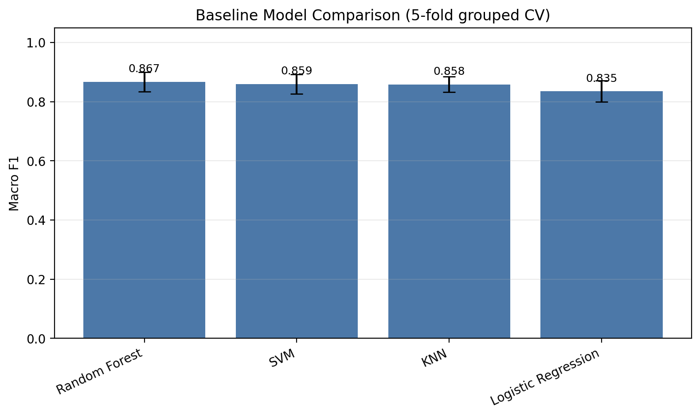
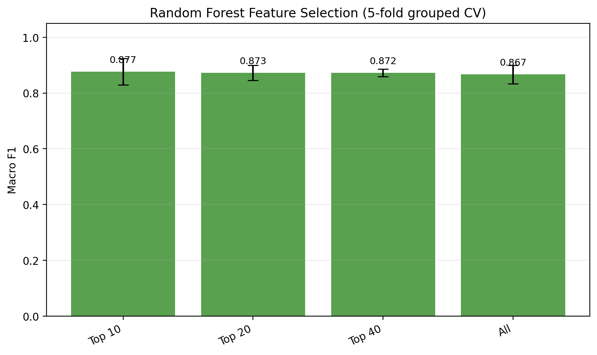
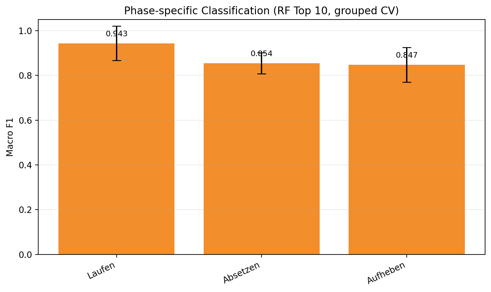
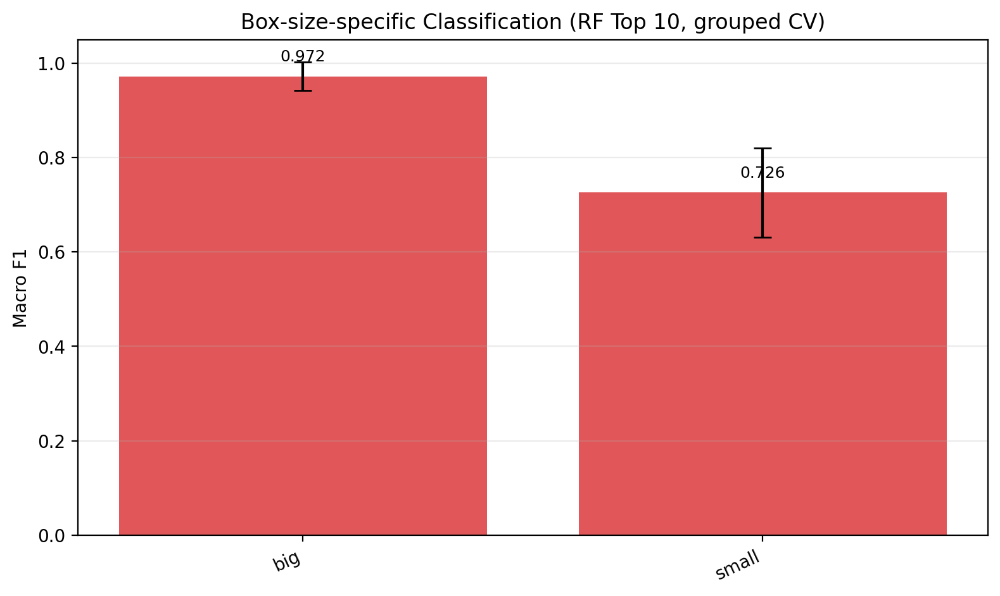
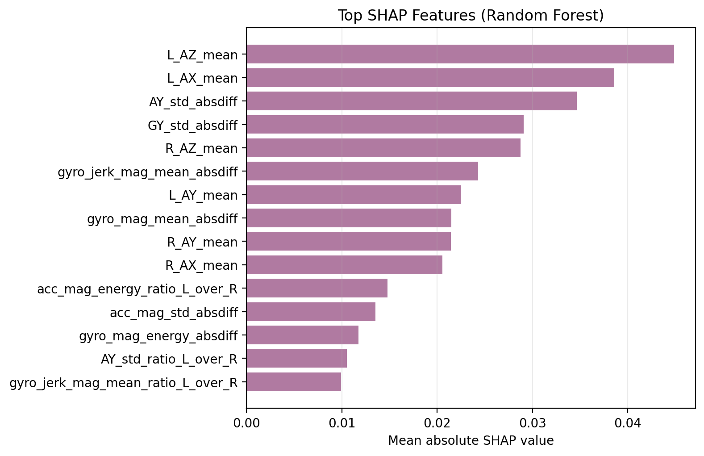
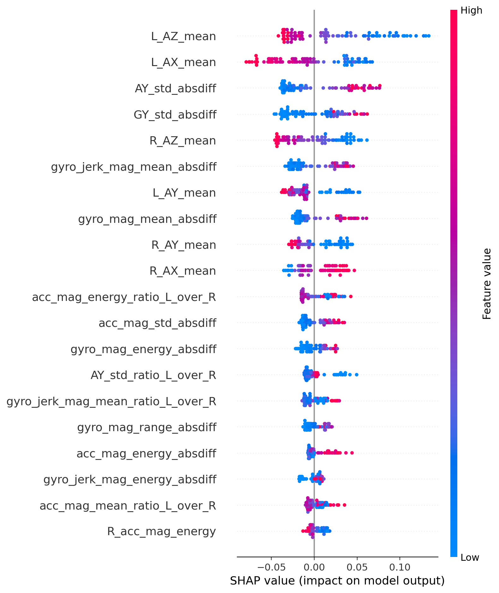

# IMU Carrying Classification Project

## Goal

This project investigates whether two wrist-worn IMU sensors can distinguish between one-handed and two-handed object carrying.

The practical motivation is ergonomic risk detection: one-sided carrying can create asymmetric physical load and may contribute to musculoskeletal strain. The intended model output is binary:

- `one_handed_carry = True`: the object was carried with one hand
- `one_handed_carry = False`: the object was carried with both hands

Left-handed and right-handed carrying are intentionally merged into the single class `one_handed_carry = True`.

## Study Setup

Each participant wore two IMU sensors, one on each wrist. The recorded sensor channels are:

- `AX`, `AY`, `AZ`: accelerometer axes
- `GX`, `GY`, `GZ`: gyroscope axes

Each trial consists of three phases:

- `Aufheben`: picking up the object
- `Laufen`: carrying/walking phase
- `Absetzen`: putting the object down

The experiment varies:

- `subject`: `David` or `Viktor`
- `box_size`: `big` or `small`
- `surface`: `table` or `floor`
- `one_handed_carry`: `True` or `False`

## Raw Data

Raw CSV files are stored in `../data/` relative to this classifier folder. Each trial was recorded once per sensor hand, so one physical experiment usually has two files:

- one file ending in `_L.csv`
- one file ending in `_R.csv`

The raw data files contain:

```text
time_s, server_time_s, GX, GY, GZ, AX, AY, AZ, phase
```

`time_s` is the watch-local time since the start signal. `server_time_s` is the laptop/server receive time.

## Preprocessing

Preprocessing is implemented in:

```text
../src/preprocessing/preprocessing.py
```

It merges all raw CSV files into:

```text
../data/preprocessed.csv
```

During preprocessing, metadata is parsed from file and folder names:

- `subject`
- `box_size`
- `sensor_hand`
- `surface`
- `one_handed_carry`

The current preprocessed dataset contains:

```text
47,413 rows
14 columns
```

Class distribution by row:

```text
one_handed_carry = True:  24,955 rows
one_handed_carry = False: 22,458 rows
```

Phase distribution by row:

```text
Laufen:   21,879 rows
Aufheben: 13,186 rows
Absetzen: 12,348 rows
```

Known issue: four empty David trials for `big box`, `both hands`, `floor` were skipped during preprocessing.

## Feature Window Generation

Feature extraction is implemented in:

```text
scripts/build_window_features.py
```

It creates the model-ready feature table:

```text
results/features_windows_1s_all_experiments.csv
```

Current window parameters:

```text
WINDOW_SIZE_S = 1.0
OVERLAP = 0.50
MIN_SAMPLES_PER_HAND = 30
TIME_REFERENCE_COL = "time_s"
ADD_SHIFTED_END_WINDOW = True
MIN_SHIFTED_END_WINDOW_START_DIFF_S = WINDOW_SIZE_S / 4
```

The current output contains:

```text
30 reconstructed experiments
478 feature windows
128 columns
```

## Experiment Reconstruction

Because `preprocessed.csv` is a merged table, the script reconstructs experiments as follows:

1. It splits the table into contiguous sensor runs.
2. A new sensor run starts when `time_s` resets or when metadata changes.
3. Neighboring runs are paired if they have the same `subject`, `box_size`, `surface`, and `one_handed_carry`, and if one run is `sensor_hand = L` while the other is `sensor_hand = R`.
4. Each valid L/R pair receives an `experiment_id`.

The current data reconstructs cleanly:

```text
60 sensor runs
30 L/R experiment pairs
0 pairing skips
```

## Window Logic

Windows are created separately for each experiment and each phase. This prevents a window from mixing samples from different phases.

For each phase:

1. The script takes the left-hand samples for that phase.
2. It takes the right-hand samples for that phase.
3. It computes the shared time range using `time_s`.
4. It creates windows of `1.0s` with `50%` overlap.
5. It optionally adds one final full-size window shifted to the phase end.
6. The shifted final window is only added if its start differs from the previous start by at least `WINDOW_SIZE_S / 4`.
7. A window is kept only if both hands have at least `MIN_SAMPLES_PER_HAND` samples.

This means each feature row represents:

```text
one experiment + one phase + one time window
```

## Feature Types

For each valid window, features are computed for left and right wrist data.

Per-axis features:

- mean
- standard deviation

Magnitude signals:

- `acc_mag = sqrt(AX^2 + AY^2 + AZ^2)`
- `gyro_mag = sqrt(GX^2 + GY^2 + GZ^2)`

For magnitude signals:

- mean
- standard deviation
- min
- max
- range
- energy

Jerk-like signals:

- `acc_jerk_mag`
- `gyro_jerk_mag`

Left-right asymmetry features:

- absolute differences between left and right features
- left/right ratios
- per-axis standard deviation differences and ratios

The target label is:

```text
one_handed_carry
```

## How To Run

From the `IMU` project root:

```bash
python src/preprocessing/preprocessing.py
python classifier/scripts/build_window_features.py
```

Alternatively, from inside `IMU/classifier`:

```bash
python scripts/build_window_features.py
```

If using Anaconda, make sure the script is run with the Conda Python, not a separate Homebrew Python.

Good check commands:

```bash
which python
python -c "import pandas as pd; print(pd.__version__)"
```

## Feature Exclusions

The following columns are present in the feature CSV but are explicitly excluded from model inputs:

| Column | Reason |
|---|---|
| `one_handed_carry` | Target label |
| `experiment_id` | Row identifier |
| `subject` | Person identity — excluded to avoid person-specific overfitting |
| `time_reference`, `window_index_in_phase`, `window_start_s`, `window_end_s` | Window bookkeeping, not motion |
| `phase` | Experiment metadata — not derivable from IMU signal alone |
| `box_size` | Experiment metadata — not derivable from IMU signal alone |
| `surface` | Experiment metadata — not derivable from IMU signal alone |
| `L_n_samples`, `R_n_samples` | Number of samples per window; depends on Bluetooth timing and packet loss, not on motion |

The remaining 116 numeric columns are the model inputs. They are derived purely from the raw sensor signals (AX, AY, AZ, GX, GY, GZ) and their magnitudes, jerk signals, and left-right asymmetry features.

## Model Training

The supervised learning target is:

```text
one_handed_carry
```

All model evaluation splits are grouped by `experiment_id`. This is important because overlapping windows from the same experiment are highly similar and must not be split across training and test data.

Implemented modeling scripts:

```text
scripts/train_classifier.py
scripts/random_forest_feature_selection.py
scripts/cross_validate_models.py
scripts/cross_validate_feature_selection.py
scripts/cross_validate_by_phase.py
scripts/cross_validate_by_box_size.py
scripts/random_forest_shap_analysis.py
```

Generated result files:

```text
results/model_baseline_results.csv
results/feature_importance_random_forest.csv
results/model_feature_selection_results.csv
results/model_baseline_cross_validation_results.csv
results/random_forest_feature_selection_cross_validation_results.csv
results/random_forest_top10_by_phase_cross_validation_results.csv
results/random_forest_top10_by_box_size_cross_validation_results.csv
results/feature_importance_shap_random_forest.csv
results/shap_summary_random_forest.png
results/plots/baseline_model_comparison_macro_f1.png
results/plots/feature_selection_macro_f1.png
results/plots/phase_comparison_macro_f1.png
results/plots/box_size_comparison_macro_f1.png
results/plots/shap_top_features_bar.png
```

## Initial 80/20 Train-Test Baseline

The first baseline used a grouped 80/20 train-test split:

```text
Train: 24 experiments
Test:   6 experiments
```

The test split was balanced on experiment level:

```text
3 one-handed experiments
3 both-handed experiments
```

Baseline model comparison on this split (sensor-only features):

| Model | Accuracy | Macro F1 |
|---|---:|---:|
| Random Forest | 0.884 | 0.882 |
| SVM | 0.826 | 0.825 |
| KNN | 0.814 | 0.814 |
| Logistic Regression | 0.802 | 0.802 |

Random Forest performed best in this initial split.

## Random Forest Feature Selection

Random Forest feature importance was used to rank features. The model was then retrained with only the top-ranked features.

Initial 80/20 split results (sensor-only features, feature ranking from CV-averaged importance):

| Feature set | Accuracy | Macro F1 |
|---|---:|---:|
| Top 10 RF features | 0.919 | 0.918 |
| Top 20 RF features | 0.907 | 0.906 |
| Top 40 RF features | 0.895 | 0.894 |
| All features | 0.884 | 0.882 |

Top 20 features by CV-averaged RF importance:

```text
L_AZ_mean
AY_std_absdiff
L_AX_mean
GY_std_absdiff
gyro_jerk_mag_mean_absdiff
L_AY_mean
R_AX_mean
R_AZ_mean
R_AY_mean
gyro_mag_mean_absdiff
gyro_jerk_mag_mean_ratio_L_over_R
AY_std_ratio_L_over_R
gyro_mag_std_absdiff
acc_mag_energy_ratio_L_over_R
acc_mag_mean_ratio_L_over_R
acc_mag_std_absdiff
gyro_mag_energy_absdiff
gyro_mag_range_absdiff
GY_std_ratio_L_over_R
gyro_jerk_mag_energy_absdiff
```

Interpretation: the selected features include both absolute wrist movement features and left-right asymmetry features. The asymmetry-related features support the project assumption that one-handed carrying creates different movement patterns between the wrists.

## SHAP Interpretation

SHAP values were added for the selected Random Forest approach. SHAP is model-specific: it explains how strongly each feature influenced the predictions of a trained model.

The SHAP analysis is implemented in:

```text
scripts/random_forest_shap_analysis.py
```

It trains a Random Forest on the same grouped 80/20 split used for the initial baseline and computes SHAP values on the test set.

Generated files:

```text
results/feature_importance_shap_random_forest.csv
results/shap_summary_random_forest.png
```

Top SHAP features (sensor-only features):

```text
L_AZ_mean
L_AX_mean
AY_std_absdiff
GY_std_absdiff
R_AZ_mean
gyro_mag_mean_absdiff
L_AY_mean
gyro_jerk_mag_mean_absdiff
R_AX_mean
R_AY_mean
```

The SHAP ranking is very similar to the Random-Forest-importance ranking. This strengthens the interpretation that the model relies on a combination of wrist orientation/movement features and left-right asymmetry features.

Important interpretation note:

```text
SHAP values show which features influenced the trained model's predictions.
They do not by themselves prove that a feature is objectively causal or universally important.
```

For this reason, SHAP is used as an explanation method, while feature-selection performance is evaluated separately through grouped cross-validation.

## Cross-Validation

Because only 30 experiments are available, a single train-test split can be sensitive to which experiments end up in the test set. Therefore, grouped cross-validation was added.

The implemented cross-validation:

- keeps all windows from the same `experiment_id` in the same fold
- approximately balances one-handed and both-handed experiments across folds
- reports mean and standard deviation across 5 folds

Baseline cross-validation results (sensor-only features):

| Model | Accuracy mean | Accuracy std | Macro F1 mean | Macro F1 std |
|---|---:|---:|---:|---:|
| Random Forest | 0.869 | 0.032 | 0.868 | 0.031 |
| SVM | 0.850 | 0.042 | 0.849 | 0.042 |
| Logistic Regression | 0.840 | 0.046 | 0.838 | 0.046 |
| KNN | 0.825 | 0.031 | 0.824 | 0.029 |

Random Forest remains the best model on average.

Random Forest feature-selection cross-validation (sensor-only features):

| Feature set | Accuracy mean | Accuracy std | Macro F1 mean | Macro F1 std |
|---|---:|---:|---:|---:|
| Top 40 RF features | 0.880 | 0.028 | 0.879 | 0.029 |
| Top 20 RF features | 0.876 | 0.041 | 0.875 | 0.040 |
| Top 10 RF features | 0.876 | 0.046 | 0.875 | 0.046 |
| All features | 0.869 | 0.032 | 0.868 | 0.031 |

In cross-validation, Top 40 features perform best. Top 10 and Top 20 are essentially equivalent. Feature selection helps, but the size of the effect should be interpreted carefully given the small dataset.

## Phase-Specific Classification

To test the project hypothesis that the walking phase contains the strongest asymmetry signal, separate Random Forest models were trained and evaluated for each phase.

Setup:

- one model for `Aufheben`
- one model for `Laufen`
- one model for `Absetzen`
- Random Forest classifier
- Top 10 feature selection inside each training fold
- grouped 5-fold cross-validation by `experiment_id`

Results (sensor-only features):

| Phase | Accuracy mean | Accuracy std | Macro F1 mean | Macro F1 std |
|---|---:|---:|---:|---:|
| Laufen | 0.944 | 0.076 | 0.943 | 0.077 |
| Aufheben | 0.872 | 0.131 | 0.869 | 0.136 |
| Absetzen | 0.863 | 0.062 | 0.862 | 0.062 |

Main finding:

```text
The walking phase shows the highest classification performance.
```

This supports the hypothesis from the project proposal: wrist movement asymmetry is most pronounced during carrying/walking, because the free arm can swing more naturally while the loaded arm tends to be more stabilized.

## Box-Size-Specific Classification

To test the auxiliary hypothesis that object size affects classification performance, separate Random Forest models were trained and evaluated for each box size.

The target remains:

```text
one_handed_carry
```

This analysis does not predict `box_size`. Instead, it asks whether one-handed vs two-handed carrying is easier to classify for `big` or `small` boxes.

Setup:

- one model for `big`
- one model for `small`
- all phases included
- Random Forest classifier
- Top 10 feature selection inside each training fold
- grouped 5-fold cross-validation by `experiment_id`

Results (sensor-only features):

| Box size | Accuracy mean | Accuracy std | Macro F1 mean | Macro F1 std |
|---|---:|---:|---:|---:|
| big | 0.967 | 0.037 | 0.965 | 0.039 |
| small | 0.771 | 0.071 | 0.763 | 0.076 |

Main finding:

```text
Classification performance is substantially higher for the big box than for the small box.
```

This supports the auxiliary hypothesis that object size affects detectability. Larger objects appear to create more distinct wrist movement patterns between one-handed and two-handed carrying.

## Current Modeling Conclusion

The current best-supported modeling choice is:

```text
Classifier: Random Forest
Feature set: Top 40 Random-Forest-importance features (best in CV); Top 10 best in single 80/20 split
Evaluation: grouped cross-validation by experiment_id
Best phase: Laufen
Best box-size condition: big
```

The most important result for the presentation/report is:

```text
One-handed vs two-handed carrying can be classified from wrist IMU features.
Classification performs best during the walking phase and is much easier for big boxes than for small boxes.
```

## Result Plots

Presentation-ready result plots are generated by:

```text
scripts/create_result_plots.py
```

Run:

```bash
python classifier/scripts/create_result_plots.py
```

Or from inside `IMU/classifier`:

```bash
python scripts/create_result_plots.py
```

The plots are saved in:

```text
results/plots/
```

### Baseline Model Comparison



### Feature Selection Comparison



### Phase Comparison



### Box Size Comparison



### SHAP Top Features



The SHAP package also produced the original SHAP summary plot:



## Remaining Possible Extensions

Useful next steps, if more time is available:

1. Evaluate one shared model trained on all phases and report performance per phase.
2. Evaluate one shared model trained on both box sizes and report performance per `box_size`.
3. Create a confusion matrix plot for the selected model.
